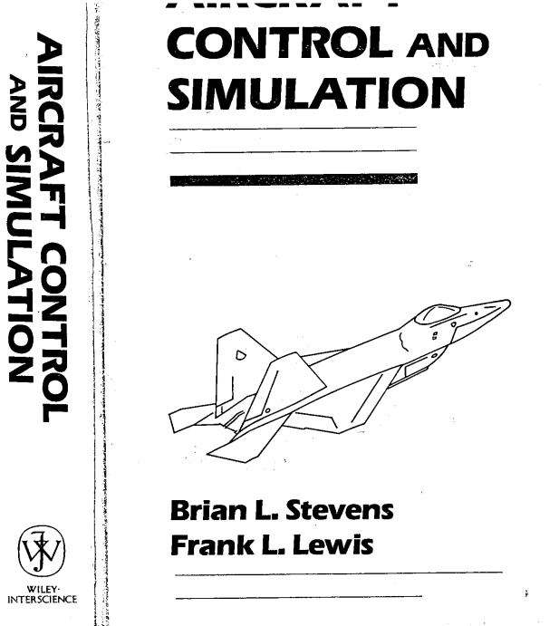
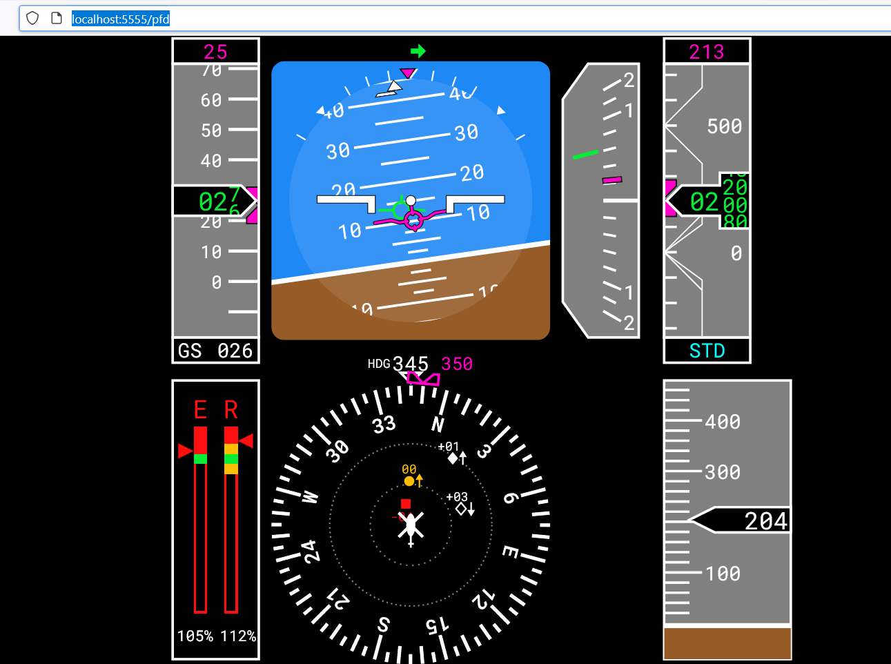

# Aircraft control and simulation - Stevens & Lewis

Uitgewerkte voorbeelde uit Aircraft control and simulation deur Stevens and Lewis

Gebruik die StevensLewis.py as die toegangsportaal van hierdie projek.

Te doen:

Ontfout die transport model met 'n sigblad.  Gebruik TransportAircraft.ods en Tabel 3.4-1 en doen nog die 500ft/s geval en die 30000ft geval.

Die optimeerder kry amper dieselfde antwoord, maar dis nie heeltemal dieselfde nie.

Doen 'n momentbalans rondom die CG.  Dit moet 0 gee.  Gaan dit na vir die drie gevalle.  Kry python om die tabel 3.4-1 te druk dat dit dieseldfe formaat het.

Moet die lidia module gebruik om instrumente mee te simuleer in python:
https://pypi.org/project/lidia/0.12.2/

Gaan na die volgende plek om die instrumente te sien:
http://localhost:5555/pfd

Gebruik die demo.py in die lidia module.  Redigeer dit en sit die nodige insette in.

